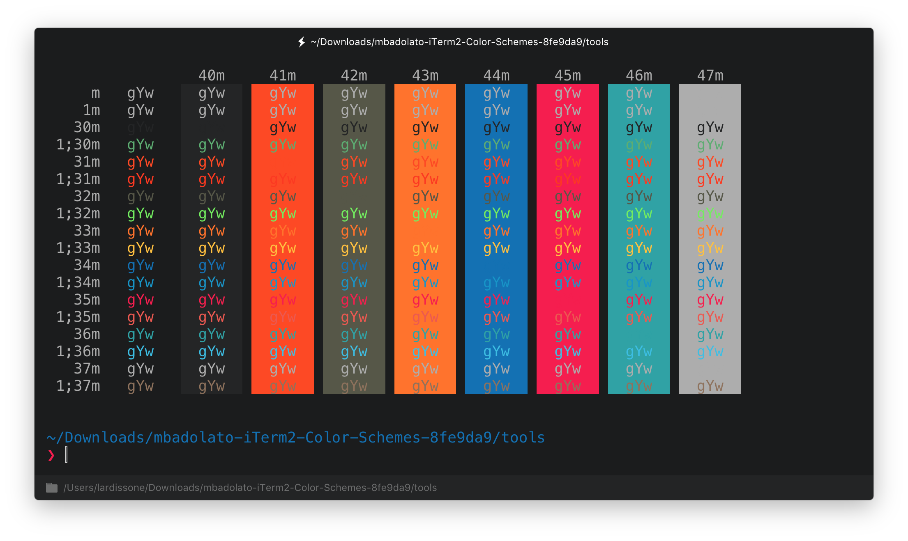

# hyper-frontend-delight

> FrontEnd Delight [Hyper](https://hyper.is) theme

Port of the great [FrontEndDelight](https://github.com/zdj/themes/blob/master/iterm2/FrontEndDelight.itermcolors) theme for iTerm2 by [zdj](https://github.com/zdj/).

## Install

Add `hyper-frontend-delight` to the plugins list in your `~/.hyper.js` config file.

## License

MIT © [Leandro Ardissone](https://leandro.ardissone.com)
